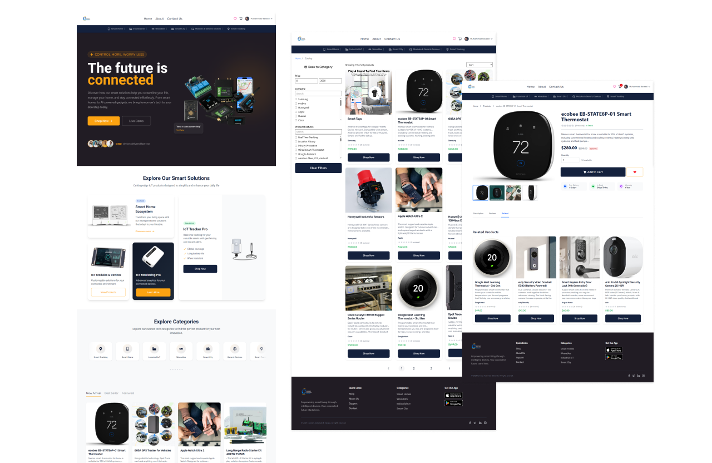
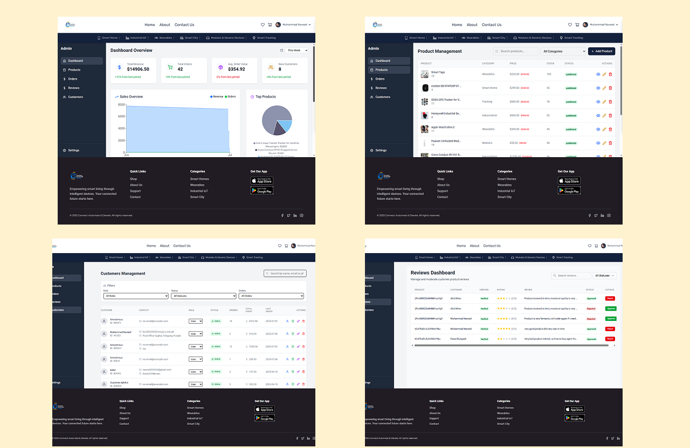

# 🛒 IoT E-Commerce Platform – Final Year Project

> **Virtual University | CS519 – Associate Degree Program (ADP)**  
> Specialization: Web Design and Development  
> **Student Name:** Muhammad Naveed  
> **Student ID:** BC230420532  

---

## 📘 Project Overview

This IoT E-Commerce Platform is a modern web application built for selling and managing Internet of Things (IoT) devices. It provides an intuitive and responsive interface for both customers and administrators to interact with a large catalog of smart devices.

---

## 🎯 Scope of Project

The main objectives and features of the platform include:

- **Browse IoT Devices**  
  Detailed product listings with descriptions, images, specifications, and user ratings.

- **Secure Checkout & Payment Integration**  
  Users can purchase devices using a secure and efficient checkout system.

- **Order & Delivery Management**  
  Track order status, shipping details, and manage delivery preferences.

- **User Accounts**  
  Registration, login, order history, and profile management for a personalized experience.

- **Admin Dashboard (Future Scope)**  
  Manage products, orders, users, and reviews from a centralized backend (planned in next phase).

---

## 🎨 User Interface Highlights

- Fully responsive UI for desktop, tablet, and mobile.
- Dynamic filtering, product detail views, and cart system.
- Clean, modern design using **Tailwind CSS 4** and **Figma prototypes**.

---

## 🧩 Tools & Technologies

| Category              | Tools / Technologies                          |
|-----------------------|-----------------------------------------------|
| Front-End Framework   | React 19.1.0                                   |
| Styling               | Tailwind CSS 4                                 |
| Build Tool            | Vite                                           |
| Backend Services      | Firebase (Firestore, Authentication)          |
| Code Editor           | Visual Studio Code                            |
| Diagramming Tools     | Microsoft Visio, Figma                        |
| Image Assets          | Unsplash, Freepik, Amazon Product Images       |
| Optimization          | TinyPNG, Chrome Dev Tools                     |
| Learning Sources      | Meta Front-End Developer (Coursera), YouTube  |
| AI Assistance         | ChatGPT (GPT-4o), OpenAI                      |

---

## 📸 Screenshots

| Home Page | Order Process | Admin Panel |
|-----------|------------------|----------------|
|  |  |  |

---

## ✅ Project Status

- ✅ Core UI implemented  
- ✅ Firebase authentication integrated  
- ✅ Firestore data storage  
- ✅ Product cards, cart, and checkout workflows  
- ✅ Admin dashboard 

---

## 👨‍💻 Developed By

**Muhammad Naveed**  
Frontend Developer & Student  
Student ID: **BC230420532**  
Virtual University of Pakistan

---

